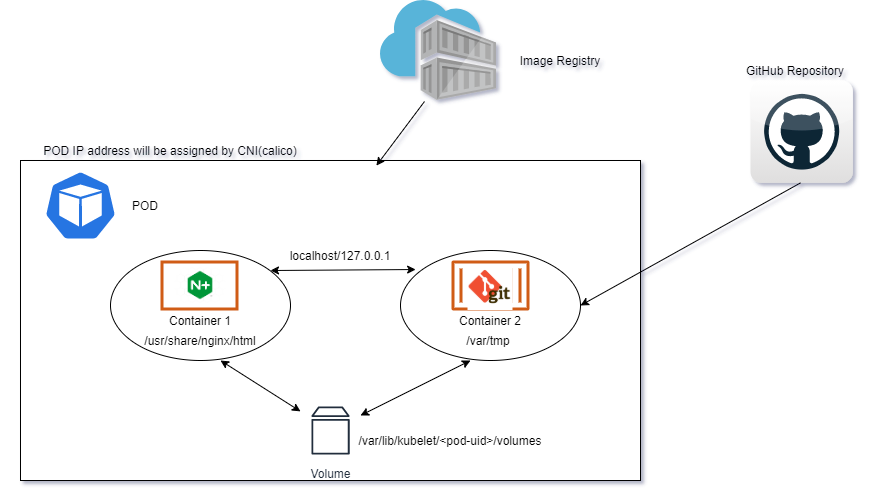

# POD

**POD will ensure that container with one or more are logically grouped to gather to have common network and shared storage. POD will assigned with an IP address with the help of CNI (container network interface add-on) like calico,  wavenet, flannel (deprecated) etc.,**

## Networking
Each Pod is assigned a unique IP address. Every container in a Pod shares the network namespace,
including the IP address and network ports. Containers inside a Pod can communicate with one another
using localhost. When containers in a Pod communicate with entities outside the Pod, they must
coordinate how they use the shared network resources (such as ports).

## Storage
A Pod can specify a set of shared storage Volumes. All containers in the Pod can access the shared
volumes, allowing those containers to share data. Volumes also allow persistent data in a Pod to
survive in case one of the containers within needs to be restarted. See Volumes for more information
on how Kubernetes implements shared storage in a Pod.

Note: The Pod remains on that Node until the process is terminated, the pod object is deleted, the
Pod is evicted for lack of resources, or the Node fails.

## resources:
CPU resources are measured in millicore. If a node has 2 cores, the
node’s CPU capacity would be represented as 2000m. The unit suffix
m stands for “thousandth of a core.” 1000m or 1000 millicore is equal
to 1 core. 4000m would represent 4 cores. 250 millicore per pod means
4 pods with a similar value of 250m can run on a single core. On a 4
core node, 16 pods each having 250m can run on that node.

Memory is measured in bytes. However, you can express memory with
various suffixes (E,P,T,G,M,K and Ei, Pi, Ti, Gi, Mi, Ki) to express
mebibytes (Mi) to petabytes (Pi). Most simply use Mi.

## Different ways to create a POD:



- POD with single container

- POD with multi-container (means more than one container)

- Static POD (controlled by kubelet component directly running as daemon on each node in the cluster, not through API server)


## Container types in POD

**POD are created with application containers, initContainers and ephemeral containers to debug**

  - Static POD kubelet service entries:
```
root@workernodeone:/etc/systemd/system/kubelet.service.d# cat 10-kubeadm.conf
# Note: This dropin only works with kubeadm and kubelet v1.11+
[Service]
Environment="KUBELET_KUBECONFIG_ARGS=--bootstrap-kubeconfig=/etc/kubernetes/bootstrap-kubelet.conf --kubeconfig=/etc/kubernetes/kubelet.conf"
Environment="KUBELET_CONFIG_ARGS=--config=/var/lib/kubelet/config.yaml"
# This is a file that "kubeadm init" and "kubeadm join" generates at runtime, populating the KUBELET_KUBEADM_ARGS variable dynamically
EnvironmentFile=-/var/lib/kubelet/kubeadm-flags.env
# This is a file that the user can use for overrides of the kubelet args as a last resort. Preferably, the user should use
# the .NodeRegistration.KubeletExtraArgs object in the configuration files instead. KUBELET_EXTRA_ARGS should be sourced from this file.
EnvironmentFile=-/etc/default/kubelet
ExecStart=
ExecStart=/usr/bin/kubelet $KUBELET_KUBECONFIG_ARGS $KUBELET_CONFIG_ARGS $KUBELET_KUBEADM_ARGS $KUBELET_EXTRA_ARGS --pod-manifest-path=/etc/kubelet.d/
root@workernodeone:/etc/systemd/system/kubelet.service.d#

Now reload the systemd daemon with "systemctl daemon-reload" and then restart kubelet service
```

POD lifecycle
PodDistributionBudget
PodPresets
RuntimeClass
https://kubernetes.io/blog/2015/06/the-distributed-system-toolkit-patterns/


